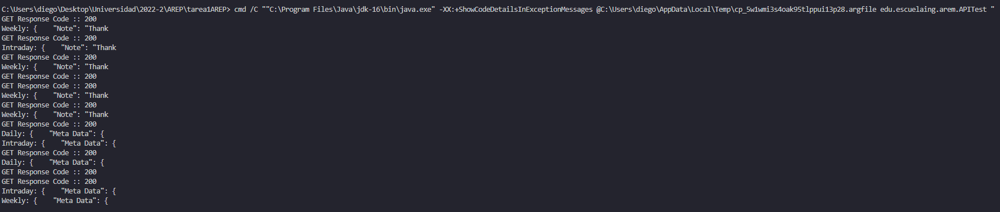

# TAREA INTRODUCCIÓN MVN-GIT Y HEROKU
## AREP-1
### Diego Leon [diegoleonb](https://github.com/diegoleonb)
#### 2020-2


## SparkWep

SparkWeb es una aplicacion que a partir de un identificador de una accion, por ejemplo IBM o MSFT, hace la consulta con el fin de mostrar al usuario el historico de valoracion de la accion, ya sea, intra-dia, diaria, semanal y mensual. Para lograr esta finalidad la aplicacion hace uso de el API de Alphavantage para las consultas en el mercado de valores.

Aqui se muestra un ejemplo de su uso:


Si desea utilizar la app puede dirigirse al siguiente enlace de Heroku:

```
http://stockarep.herokuapp.com/
```

Si desea dirigirse automaticamente dele click [stockarep](http://stockarep.herokuapp.com/)

## Arquitectura

El cliente Web hace uso de servicios REST donde el servidor va a invocar metodos REST para procesar la solicitud y posteriormente devolverse en un formato JSON para una facil lectura y entendimiento. Ademas, de implementar una memoria Cache
Asimismo, se hace uso del protocolo HTTP como canal de comunicacion y con el fin de hacer una interfaz grafica agradable para el usuario se hace uso de HTML, CSS y JavaScript.

## Tree


## Enlazar con otro Proveedor de Servicios

Para enlazar con otro proveedor de servicios vamos a hacerlo similar a como hacemos con Alphavantage, es decir, se crea una clase Polygon que extienda de de APIClass y para cada funcion que deseemos como "Aggregates" se cree una clase que extienda de Polygon para asi poder enviarle a APIClass la URL y la key para realizar la correspondiente conexion. Para posteriormente hacer su respectiva verificacion de lo que desee el cliente en SparkWebApp donde se identifica la funcion. (Respecto al backend)

## Requisitos para correr el programa (Por medio de localhost)

- [Java](https://www.java.com/es/download/)
- [Maven](https://maven.apache.org/download.cgi)
  
## Como correr SparkWebApp

Compilar: 

```
mvn package
```
Ejecutarlo:

```
java -cp target/classes:target/dependency/* edu.escuelaing.arem.SparkWebApp
```

En caso de estar en Windows hay que cambiar los dos puntos por punto y coma (: -> ;):

```
java -cp target/classes;target/dependency/* edu.escuelaing.arem.SparkWebApp
```

## Documentacion

```
mvn javadoc:javadoc
```

La documentacion se guarda en la ruta: target\site\apidocs\index.html


## Pruebas

Para garantizar el correcto funcionamiento de nuestra aplicacion vamos a realizar unas pruebas de concurrencia en su servidor de backend:

5 hilos:


10 hilos:



## Interfaz Grafica desde Celular


## Licencia

[LICENCIA](License.txt)


